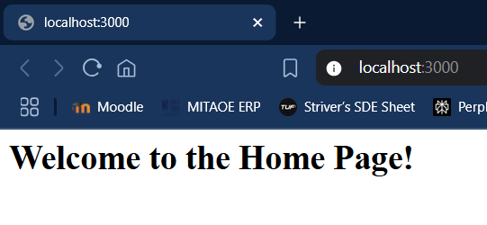
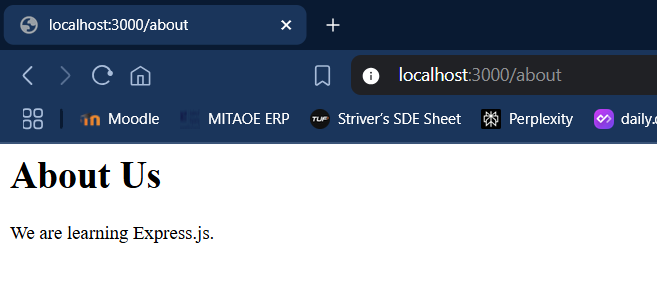

# Express.js Server

A simple Express.js server application built for learning purposes. This server demonstrates basic routing, middleware usage, and RESTful API endpoints.

## Features

- **Basic Routing**: Home and About pages
- **Middleware Integration**: Request logging and JSON parsing
- **RESTful API**: POST endpoint for data handling
- **Clean Architecture**: Well-structured and documented code

## Screenshots

### Home Page

*Welcome page accessible at localhost:3000*

### About Page

*About page accessible at localhost:3000/about*

## Installation

1. Clone the repository:
```bash
git clone <repository-url>
cd express-server
```

2. Install dependencies:
```bash
npm install express
```

3. Start the server:
```bash
node server.js
```

4. Open your browser and navigate to `http://localhost:3000`

## API Endpoints

### GET Routes

| Endpoint | Description | Response |
|----------|-------------|----------|
| `/` | Home page | HTML welcome message |
| `/about` | About page | HTML about information |

### POST Routes

| Endpoint | Description | Request Body | Response |
|----------|-------------|--------------|----------|
| `/data` | Submit data | JSON object | Confirmation with received data |

## Usage Examples

### Accessing Routes
```bash
# Home page
curl http://localhost:3000/

# About page
curl http://localhost:3000/about
```

### Sending Data
```bash
curl -X POST http://localhost:3000/data \
  -H "Content-Type: application/json" \
  -d '{"name": "John", "age": 30}'
```

## Project Structure

```
express-server/
├── server.js          # Main server file
├── README.md          # Project documentation
└── screenshots/       # Application screenshots
    ├── home-page.png
    └── about-page.png
```

## Middleware

- **Request Logger**: Logs all incoming requests with timestamp, method, and URL
- **JSON Parser**: Enables parsing of JSON request bodies for POST requests

## Technologies Used

- **Node.js**: JavaScript runtime environment
- **Express.js**: Web framework for Node.js

## Development

To modify the server:

1. Edit `server.js` to add new routes or middleware
2. Restart the server to see changes
3. Test endpoints using a browser or API client like Postman

## Learning Objectives

This project demonstrates:
- Setting up an Express.js server
- Creating route handlers
- Implementing middleware functions
- Handling different HTTP methods
- Parsing JSON request bodies
- Serving HTML content

## License

This project is for educational purposes.